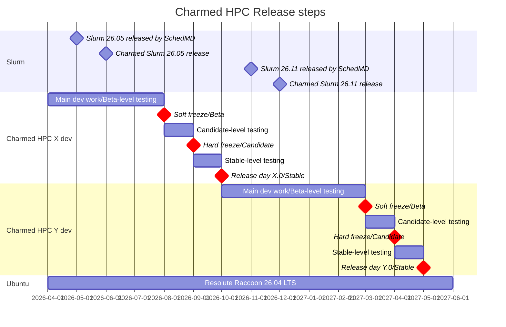

# Release policy for Charmed HPC

## Abstract

This spec defines the release policy for Charmed HPC, a portfolio of charms and supporting artifacts.

The policy covers the versioning scheme (`<major release>.<patch version #>`), the twice-yearly release cadence and how it relates to the per-component cadences defined in their own specs, the Ubuntu base a release is built against, the Charmhub channels and GitHub branches used for each constituent charm, the risk statuses and the soft-freeze / hard-freeze / release-day points that gate promotion between them, the supported upgrade paths, the support life-cycle for each Charmed HPC release, and the format and sections of the published release notes. A companion [Release Notes Template](release-notes-template.md) accompanies this spec.

## Rationale

A consistent release policy is necessary to keep our community aware of upcoming major changes, bug fixes, and security updates, while ensuring that the community has some expected degree of stability.

Charmed HPC is a composition of multiple charms and supporting artifacts. Some constituent component (e.g. Charmed Slurm) follows its own upstream-driven release cadence and has its own spec. There must, however, be a well-defined, Charmed-HPC-wide release policy that developers and users can reference to know:

* When new features, bug fixes, and security updates can be expected across the set of charms.
* Which charm versions have been verified to work together as a single Charmed HPC release.
* What compatibility guarantees apply to a `Stable` channel (no breaking changes to integrations, configuration options, or actions).
* How the release progresses from soft freeze, to Beta, to Candidate, to Stable.
* How long a given Charmed HPC release is supported, and what "end of support" means.
* What information is published in release notes, and in what format.

Without such a policy, users cannot reliably schedule upgrades, security patching, or feature adoption across a Charmed HPC deployment, and the maintainers lack a shared reference for release planning, freeze dates, and channel promotion criteria.

## Specification

### Artifacts

Charmed HPC artifacts:

<!-- Update this list as the Charmed HPC portfolio evolves -->

- Charmed Slurm (see [UHPC 003](../UHPC%20003%20-%20Release%20policy%20and%20notes%20for%20Charmed%20Slurm/uhpc-003.md))
- apptainer-operator
- filesystem-charms:
  - cephfs-server-proxy
  - filesystem-client
  - lustre-server-proxy
  - nfs-server-proxy
  - test-mount-client
- lustre-server
- sssd-operator

An artifact is listed above if it is maintained by the Charmed HPC team and is deployed by the user as part of a Charmed HPC deployment. On this basis:

* Dependencies that are not user-facing are **not** listed as release artifacts and are not versioned in the release notes. For example, `charmed-hpc-libs` (see [UHPC 008](../UHPC%20008%20-%20%60charmed-hpc-libs%60%20for%20HPC%20charm%20development/uhpc008.md)) and the Slurm interface packages (see [UHPC 009](../UHPC%20009%20-%20Distributing%20Slurm%20interfaces%20as%20Python%20packages/uhpc009.md)) are internal development dependencies that a user does not interact with directly.
* Charms that Charmed HPC depends on but does not maintain (e.g. MySQL, `smtp-integrator`) are **not** Charmed HPC artifacts. The specific versions that each Charmed HPC release is tested against are instead recorded in the compatible versions table below.

#### Compatible third-party charm versions

Each Charmed HPC release records the third-party charm versions it has been tested against. These charms are not Charmed HPC artifacts and are not released by the Charmed HPC team, but a release is only supported in combination with the versions listed.

| Charm | Channel | Revision | Required by | Notes |
|-------|---------|----------|-------------|-------|
| mysql | `8.4/stable` | `<revision>` | `slurmdbd` | |
| smtp-integrator | `<channel>` | `<revision>` | `slurmctld` (email notifications, see [UHPC 006](../UHPC%20006%20-%20User%20email%20notifications%20in%20Charmed%20Slurm/uhpc-006.md)) | Optional |

#### Support matrix

Each Charmed HPC release publishes a support matrix recording what has been tested, how deeply it has been tested, and what is supported as a result. Combinations that are known not to work, or that are explicitly out of scope, are listed as unsupported.

| Combination | Tested | Depth of testing | Supported |
|-------------|--------|------------------|-----------|
| `<artifact>` on `<Ubuntu base>` with `<Juju version>` | Yes/No | Unit / integration / scale / full QA | Supported / Unsupported |

Unsupported combinations:

* Mixing artifact versions from different Charmed HPC releases.
* Ubuntu bases other than the LTS release a given Charmed HPC release is built against.

> **[DECISION NEEDED]** Define the axes and granularity of the support matrix: which combinations are enumerated (artifact x Ubuntu base x Juju version x third-party charm version?), what the depth-of-testing levels are, and how "supported" is defined for a combination that is tested but only at a shallow depth.

#### Versioning scheme

Version format: `<major release>.<patch version #>`. Example Charmed HPC release numbers:

- Initial release: "1.0"
- Bugfix release: "1.1"
- Security update: "1.2"

* Major release - new features, updated artifact versions, and potentially a new Ubuntu base version
* Minor release - bug and security fixes only
  * Bug fixes and security updates both increment the same patch component; the version number alone does not distinguish a bugfix release from a security release. The release notes record which fixes a release contains.
  * Note that running `juju refresh` is necessary to pull the latest security and bug fix updates

> **[DECISION NEEDED]** Confirm the versioning scheme. The format above is `<major release>.<patch version #>`, giving versions such as "1.0" and "1.1". A calendar-based `<YY>.<MM>` scheme has also been proposed, under which a release would be named for the year and month it is cut and would contain the artifact versions available at that time - for example, Charmed HPC "27.10" containing Slurm 27.05. A calendar scheme would be more consistent with the `<upstream Slurm version>-<patch version #>` scheme used by Charmed Slurm in [UHPC 003](../UHPC%20003%20-%20Release%20policy%20and%20notes%20for%20Charmed%20Slurm/uhpc-003.md), but would need a defined patch component, since the month occupies the position a patch digit would otherwise use (e.g. `27.10.1` or `27.10-1`). This decision affects every version string in this spec and in the release notes template, the definitions of major and minor releases above, and the supported upgrade paths below.

### Release cadence

Charmed HPC is released **twice yearly**. Each release includes the most recent artifact versions available at the time it is cut; for example, a release cut in October 2027 would include Slurm 27.05.

Individual components within Charmed HPC (e.g. Charmed Slurm) may follow their own upstream-driven release cadences as defined in their respective specs. Since Charmed HPC is a set of charms rather than a single deployable artifact, a Charmed HPC release defines a tested, compatible set of charm versions that are verified to work together.

> **[DECISION NEEDED]** What is the cadence for bug fix and security releases within a cycle - i.e. how long after a major release does its first patch release follow, and are patches batched on a fixed schedule or cut as needed?

> **[DECISION NEEDED]** Is a process needed to fast-track critical security fixes outside the normal patch cadence? Review proposed that such a release could require only a subset of tests to pass, with agreement from some number of the team. Note that this interacts with the promotion gate for the Stable risk status, below.

#### Ubuntu base support

Each Charmed HPC release is built against the **latest Ubuntu LTS** release at the time of the release. A given Charmed HPC release supports a **single** Ubuntu base; running a release on any other base, including an older LTS, is not supported.

Because Charmed HPC releases twice yearly and an Ubuntu LTS is released every two years, most Charmed HPC releases will not introduce a new Ubuntu base.

#### Release channels and branches

Since Charmed HPC is a set of charms rather than a single charm, release channels apply to each constituent charm individually.

* Each track has a corresponding GitHub branch
* Each track on Charmhub provides four channels:
   * Edge, the development channel
   * Beta
   * Candidate, to test the new release before publishing
   * Stable
     * No breaking changes will be made to integrations, configuration options, or actions in a stable channel of a charm

#### Release cycle and feature freezes

Two distinct concepts drive the release cycle: the **risk status** a charm can be published at, and the **freeze points** in time that gate promotion between them.

##### Risk status

Edge, Beta, Candidate and Stable are *risk statuses*. A charm advances through these statuses in order, with each status gated by a progressively more thorough level of testing:

* **Edge** — the development status. To reach this status, Edge-level testing must pass: basic PR tests (unit and basic integration).
* **Beta** — to reach this status, Beta-level testing must pass: integration test suites.
* **Candidate** — to reach this status, Candidate-level testing must pass: scalability and security testing.
* **Stable** — to reach this status, Stable-level testing must pass: one month at Candidate with no breakages found in testing.

Testing is named after the risk status it qualifies a charm for, so a charm at Beta undergoes Candidate-level testing in order to be promoted to Candidate.

> **[DECISION NEEDED]** Define the specific final test suites that make up each level of testing, so that promotion is unambiguous. In particular, name the integration suites required for Beta-level testing, and the scalability and security suites required for Candidate-level testing.

> **[DECISION NEEDED]** Is the "one month with no breakages" gate in Stable-level testing absolute? Review proposed retaining the option to release with a documented Known Issue where a test failure is low impact. If waivers are permitted, define who signs them off and how they are recorded in the release notes.

##### Freeze points

Freeze points are the dates by which the **final** round of testing for a risk status must be complete. Testing is not confined to these dates: charms are tested against the rest of the Charmed HPC set throughout the cycle, and a charm may complete Beta- or Candidate-level testing well before the corresponding freeze. The freeze is the point at which the last such round must have finished for a charm to be included in the release at that risk status.

* **Soft freeze** — the date by which final Beta-level testing must be complete. New feature work targeting this release stops, and each charm that has passed is promoted from Edge to **Beta**. Development of features targeting the *next* release continues.
* **Hard freeze** — the date by which final Candidate-level testing must be complete. Each charm that has passed is promoted from Beta to **Candidate**.
* **Release day** — the date by which final Stable-level testing must be complete. All charms that have passed are promoted from Candidate to **Stable**.

Given the variety of charms, the Candidate/Stable for a given charm may be the same as for the prior release.

Freeze dates are set by the Charmed HPC team during cycle planning. The soft freeze is set **two months before release day**, so that Candidate-level testing has time to reveal issues before the release is cut.

> **[DECISION NEEDED]** How far in advance are freeze dates announced, and where are they published?

> **[DECISION NEEDED]** This diagram needs updating once the versioning scheme is settled. It currently shows release spacing of seven months rather than the twice-yearly cadence defined above, and a shorter lag behind upstream Slurm than the approximately six months defined in [UHPC 003](../UHPC%20003%20-%20Release%20policy%20and%20notes%20for%20Charmed%20Slurm/uhpc-003.md).

### Support life-cycle

Bug and security fix support for each Charmed HPC release is tied to the **Ubuntu LTS** release it is built against, and is provided under the terms of **Ubuntu Pro** support.

> **[DECISION NEEDED]** Confirm that Charmed HPC is in scope for Ubuntu Pro, and at which tier, and link to the authoritative statement of those terms. The support commitment published in the release notes should cite it directly.

> **[DECISION NEEDED]** Charmed Slurm commits to bug and security fix support for 1 year, following the upstream Slurm life-cycle ([UHPC 003](../UHPC%20003%20-%20Release%20policy%20and%20notes%20for%20Charmed%20Slurm/uhpc-003.md)), while SchedMD supports each Slurm release for 18 months. Tying Charmed HPC support to the Ubuntu LTS cycle is a significantly longer commitment, so a Charmed HPC release would remain in support after the Charmed Slurm version it contains has left support. Should Charmed Slurm and Charmed HPC have separate support life-cycles at all? If not, UHPC 003 needs amending; if so, this spec needs to state which policy applies to Slurm artifacts within a supported Charmed HPC release.

### Documentation

Warnings/limitations that will be included in the published documentation alongside the release notes:

* Due to potential breaking changes between major releases, Charmed HPC cannot guarantee cross-compatibility between major releases
  * If a user requirement necessitates artifact versions that are not from a single release, they should open an issue on GitHub (or Discourse) and work with the team

> **[DECISION NEEDED]** Define what cross-compatibility between major releases means in practice. Does a new major release of any single artifact require a new major Charmed HPC release, and which specific guarantees (integrations, configuration options, actions, data formats) are covered?

### Release Notes Template

See the [Release Notes Template](release-notes-template.md) for the template used when drafting a new release's notes.

### Release notes sections

General release notes sections for Charmed HPC:

* Release summary
* Artifacts and versions included in the release
* What's new (features and improvements)
* Bug fixes and security fixes
* Requirements and compatibility (Ubuntu base, Juju version range, compatible third-party charm versions)
* Support matrix
* Backwards incompatible changes
* Deprecated features
* Known issues
* Upgrade notes (including `juju refresh` instructions)
* Support lifecycle
* Acknowledgements

> **[DECISION NEEDED]** Should a deprecation timeline be committed to, for example "deprecated features are retained for at least two major versions"? Review suggested that if no commitment is made now, the Deprecated features section should be removed from the template and reinstated when there is a need to deprecate a feature.

#### Upgrades

Only upgrades between **minor versions** within the same major release are supported. There is no in-place upgrade path between major releases.

> **[DECISION NEEDED]** Define the migration or replacement path between major releases, given that in-place major upgrades are not supported. Is the expectation that users deploy a new cluster alongside the existing one and migrate, and what guidance and tooling is provided?

> **[DECISION NEEDED]** Are minor upgrades required to be sequential (e.g. `.1` to `.2` to `.3`), or may versions be skipped? Review proposed supporting only sequential upgrades initially.

> **[DECISION NEEDED]** Must all charms in a Charmed HPC release be upgraded together? Review proposed that upgrading a subset of charms to their versions from a newer release, while leaving others at their current versions, is not supported.

> **[DECISION NEEDED]** Are downgrades supported, and if so between which versions?

> **[DECISION NEEDED]** How are database upgrades handled during a refresh, for example the `slurmdbd` schema and its MySQL backend? Define the required ordering of charm refreshes and any backup steps a user must take beforehand.

## References

* [UHPC 003 - Release policy for Charmed Slurm](../UHPC%20003%20-%20Release%20policy%20and%20notes%20for%20Charmed%20Slurm/uhpc-003.md)
* [Canonical product release cycles](https://ubuntu.com/about/release-cycle#ubuntu)
