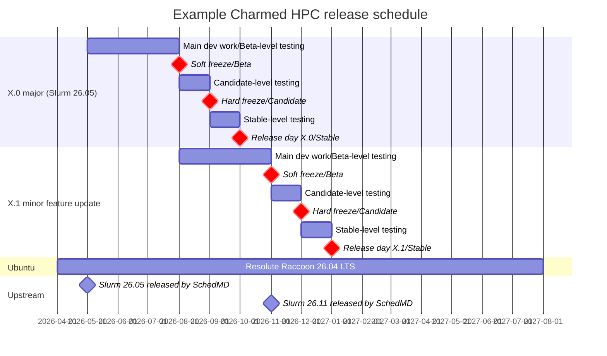

# Release policy for Charmed HPC

## Abstract

This spec defines the release policy for Charmed HPC, a single product underpinned by a portfolio of charms and supporting artifacts.

The policy covers the versioning scheme (`<major>.<minor>`), the release schedule (one major release batching breaking changes and new upstream releases, and one minor feature update, per six-month cycle), how bug and security patch timing is gated on criticality, how these relate to upstream release cadences (e.g. Slurm), the Ubuntu base a release is built against, the soft-freeze / hard-freeze / release-day points that gate promotion between risk statuses, and the format and sections of the published release notes. The risk statuses themselves (`edge`, `beta`, `candidate`, `stable`) and the testing required to reach each are defined in the companion [UHPC 017](../UHPC%20017%20-%20Charm%20and%20solution%20promotion%20criteria%20for%20Charmed%20HPC/uhpc017.md). A companion [Release Notes Template](release-notes-template.md) accompanies this spec.

## Rationale

A consistent release policy is necessary to keep our community aware of upcoming major changes, bug fixes, and security updates, while ensuring that the community has some expected degree of stability.

Charmed HPC is a composition of multiple charms and supporting artifacts, some of which (e.g. the Slurm charms) operate upstream projects that follow their own release cadences. There must be a well-defined, Charmed-HPC-wide release policy that developers and users can reference to know:

* When new features, bug fixes, and security updates can be expected across the set of charms.
* Which charm versions have been verified to work together as a single Charmed HPC release.
* What compatibility guarantees apply to a `Stable` channel (no breaking changes to integrations, configuration options, or actions).
* How long a given Charmed HPC release is supported, and what "end of support" means.
* What information is published in release notes, and in what format.

Without such a policy, users cannot reliably schedule upgrades, security patching, or feature adoption across a Charmed HPC deployment, and the maintainers lack a shared reference for release planning, freeze dates, and channel promotion criteria.

## Specification

### Artifacts

Charmed HPC artifacts:

<!-- Update this list as the Charmed HPC portfolio evolves -->

- slurm-charms:
  - slurmctld
  - slurmd
  - slurmdbd
  - sackd
  - slurmrestd
- apptainer-operator
- filesystem-charms:
  - cephfs-server-proxy
  - filesystem-client
  - lustre-server-proxy
  - nfs-server-proxy
- lustre-server
- sssd-operator
- openssh-operator

An artifact is listed above if it is maintained by the Charmed HPC team and is deployed by the user as part of a Charmed HPC deployment. On this basis:

* Dependencies that are not user-facing are **not** listed as release artifacts and are not versioned in the release notes. For example, `charmed-hpc-libs` (see [UHPC 008](../UHPC%20008%20-%20%60charmed-hpc-libs%60%20for%20HPC%20charm%20development/uhpc008.md)) and the Slurm interface packages (see [UHPC 009](../UHPC%20009%20-%20Distributing%20Slurm%20interfaces%20as%20Python%20packages/uhpc009.md)) are internal development dependencies that a user does not interact with directly; versions are pinned within charm releases to account for updates in these dependencies.

#### Compatible third-party charms

Each Charmed HPC release records the third-party charm versions it has been tested against. These charms (e.g. MySQL, `smtp-integrator`) are not Charmed HPC artifacts and are not released by the Charmed HPC team, but a release is only supported in combination with the versions listed. The channel and revision of each are recorded in the release notes (see the [Release Notes Template](release-notes-template.md)).

Third-party charms:

<!-- Update this list as Charmed HPC dependencies evolve -->

- mysql - required by `slurmdbd`
- cos-lite - required by `slurmctld` for observability via `cos-agent`; Kubernetes, cross-model
- authentik-server - required by `sssd` for identity; Kubernetes, cross-model; optional
- smtp-integrator - required by `slurmctld` for email notifications (see [UHPC 006](../UHPC%20006%20-%20User%20email%20notifications%20in%20Charmed%20Slurm/uhpc-006.md)); optional

### Versioning scheme

Version format: `<major>.<minor>`. Example Charmed HPC release numbers:

- Initial major release: "1.0"
- Minor feature update: "1.1"
- Bug or security patch: "1.2"
- Six-monthly major release (new upstream releases and/or breaking changes): "2.0"
- Minor feature update: "2.1"

* Major release - batches breaking changes (e.g. to integrations, configuration options, actions, or the Ubuntu base) and/or new upstream releases of underlying software (e.g. Slurm, Lustre). Released once per six-month cycle.
* Minor release - minor feature updates (new features, no breaking changes; once per six-month cycle) and bug and security patches. Minor releases contain no breaking changes and no new upstream releases.
  * Feature updates, bug fixes, and security updates all increment the same minor component; the version number alone does not distinguish them. The release notes record what a release contains.

#### Supported versions

The release notes for each Charmed HPC release list the supported Ubuntu base, the supported Juju version range, and the versions of each Charmed HPC artifact and third-party charm included in or tested with the release. Only the listed versions are promised to work together.

Compatibility is only guaranteed between charm revisions from the **same major and minor release** (e.g. all charms from `2.1`). There is no promise of compatibility between charm revisions from different releases, including different minor releases within the same major release (e.g. mixing `2.0` and `2.1` revisions). Any such combination is not supported.

#### Ubuntu base support

Each Charmed HPC major release is built against the **latest Ubuntu LTS** release at the time it is cut, and all minor releases within that major release use the same base. A given Charmed HPC release supports a **single** Ubuntu base; running a release on any other base, including an older LTS, is not supported. The supported base is listed in the release notes for each release.

Moving to a new Ubuntu base is a breaking change, so a new base is only introduced in a new major release.

### Release cadence

Charmed HPC releases on a six-month cycle with two anticipated release slots per cycle (four per year): **one major release and one minor feature update per cycle**, alternating approximately every three months. Cycles are late May to early October and late October to early May. 

* **Major releases** (`X+1.0`) are released **once per cycle**. A major release batches together breaking changes and/or new upstream releases of the underlying software (e.g. Slurm, Lustre); for example, a major release cut in October 2027 would include Slurm 27.05. Breaking changes and new upstream releases are held back from minor releases until the next major release. If there are no breaking changes or new upstream releases to batch, that slot is a minor feature update instead.
* **Minor feature updates** (`X.Y`) are released **once per cycle**, between major releases. Each includes new features that introduce no breaking changes.

Bug and security patches are not tied to this schedule.

#### Bug and security patches

Bug and security patches are released as minor releases outside the scheduled release slots. The release timing is gated on the criticality of the issue it fixes.

#### Release channels and branches

Since Charmed HPC is a set of charms rather than a single charm, release channels apply to each constituent charm individually. The channel and branch model - tracks, the `edge`/`beta`/`candidate`/`stable` risk ladder, and the track-to-branch mapping - is defined in [UHPC 017](../UHPC%20017%20-%20Charm%20and%20solution%20promotion%20criteria%20for%20Charmed%20HPC/uhpc017.md).

* No breaking changes will be made to integrations, configuration options, or actions in a stable channel of a charm.

#### Release cycle and feature freezes

Two distinct concepts drive the release cycle: the **risk status** a charm can be published at, and the **freeze points** in time that gate promotion between them. The risk statuses (`edge`, `beta`, `candidate`, `stable`) and the testing required to reach each are defined in [UHPC 017](../UHPC%20017%20-%20Charm%20and%20solution%20promotion%20criteria%20for%20Charmed%20HPC/uhpc017.md).

Freeze points apply to minor feature updates and major releases. Bug and security patches are not subject to freeze points; their timing is set by criticality, as described in [Bug and security patches](#bug-and-security-patches).

##### Freeze points

Freeze points are the dates by which the **final** round of testing for a risk status must be complete. Testing is not confined to these dates: charms are tested against the rest of the Charmed HPC set throughout the cycle, and a charm may complete Beta- or Candidate-level testing well before the corresponding freeze. The freeze is the point at which the last such round must have finished for a charm to be included in the release at that risk status.

* **Soft freeze** — the date by which final Beta-level testing must be complete. New feature work targeting this release stops, and each charm that has passed testing is promoted from Edge to **Beta**. Development of features targeting the *next* release continues.
* **Hard freeze** — the date by which final Candidate-level testing must be complete. Each charm that has passed testing is promoted from Beta to **Candidate**.
* **Release day** — the date by which final Stable-level testing must be complete. All charms that have passed testing are promoted from Candidate to **Stable**.

Given the variety of charms, the Candidate/Stable for a given charm may be the same as for the prior release.

Freeze dates are set by the Charmed HPC team during cycle planning. The soft freeze is set **two months before release day**, so that Candidate-level testing has time to reveal issues before the release is cut. Because scheduled releases are three months apart, development overlaps: work targeting the next release begins at the previous release's soft freeze.

<!--  
section X+1.0 major (Slurm 26.11)
    Main dev work/Beta-level testing                        :f7, 2026-11, 2027-02
    Soft freeze/Beta                                        :crit, milestone, v5, 2027-02, 0d
    Candidate-level testing                                 :f8, 2027-02, 2027-03
    Hard freeze/Candidate                                   :crit, milestone, v6, 2027-03, 0d
    Stable-level testing                                    :f9, 2027-03, 2027-04
    Release day X+1.0/Stable                                :crit, milestone, r3, 2027-04, 0d
section X+1.1 minor feature update
    Main dev work/Beta-level testing                        :f10, 2027-02, 2027-05
    Soft freeze/Beta                                        :crit, milestone, v7, 2027-05, 0d
    Candidate-level testing                                 :f11, 2027-05, 2027-06
    Hard freeze/Candidate                                   :crit, milestone, v8, 2027-06, 0d
    Stable-level testing                                    :f12, 2027-06, 2027-07
    Release day X+1.1/Stable                                :crit, milestone, r4, 2027-07, 0d
-->

<!---
### Support life-cycle

Bug and security fix support for each Charmed HPC release is tied to the **Ubuntu LTS** release it is built against, and is provided under the terms of **Ubuntu Pro** support.

> **[DECISION NEEDED]** With a major release every six months, tying support to the Ubuntu LTS would leave several major releases in support at once. How many major releases are supported concurrently, and does each remain supported for the full lifetime of its Ubuntu LTS?

> **[DECISION NEEDED]** Confirm that Charmed HPC is in scope for Ubuntu Pro, and at which tier, and link to the authoritative statement of those terms. The support commitment published in the release notes should cite it directly.

> **[DECISION NEEDED]** SchedMD supports each Slurm release for 18 months. Tying Charmed HPC support to the Ubuntu LTS cycle is a significantly longer commitment, so a Charmed HPC release would remain in support after upstream support for the Slurm version it contains has ended. This spec needs to state how bug and security fixes are provided for the Slurm charms within a supported Charmed HPC release once upstream support has ended.
-->

### Documentation and Release Notes

Warnings/limitations that will be included in the published documentation alongside the release notes:

* Charmed HPC only guarantees compatibility between charm revisions from the same major and minor release. Revisions from different releases, including different minor releases within the same major release, are not guaranteed to work together
  * If a user requirement necessitates artifact versions that are not from a single release, they should open an issue on GitHub (or Discourse) and work with the team.

#### Release Notes Template

See the [Release Notes Template](release-notes-template.md) for the template used when drafting a new release's notes.

#### Release notes sections

General release notes sections for Charmed HPC:

* Release summary
* Artifacts and versions included in the release
* What's new (features and improvements)
* Bug fixes and security fixes
* Requirements and compatibility (Ubuntu base, Juju version range, compatible third-party charm versions)
* Backwards incompatible changes
* Deprecated features
* Known issues
<!--* Upgrade notes (including `juju refresh` instructions)-->
<!--* Support lifecycle-->
* Acknowledgements

<!--#### Upgrades

Only upgrades between **minor versions** within the same major release are supported. There is no in-place upgrade path between major releases.

> **[DECISION NEEDED]** Define the migration or replacement path between major releases, given that in-place major upgrades are not supported. Is the expectation that users deploy a new cluster alongside the existing one and migrate, and what guidance and tooling is provided?

> **[DECISION NEEDED]** Are minor upgrades required to be sequential (e.g. `.1` to `.2` to `.3`), or may versions be skipped? Review proposed supporting only sequential upgrades initially.

All charms in a deployment must be refreshed to the same Charmed HPC release. Because compatibility is only guaranteed between revisions from the same major and minor release, refreshing a subset of charms to a newer release while leaving others at their current revisions is not supported.

> **[DECISION NEEDED]** A refresh necessarily passes through a state where some charms are at the new release and others are not. Is this transient state supported during an upgrade, and if so, what refresh ordering is required?

> **[DECISION NEEDED]** Are downgrades supported, and if so between which versions?

> **[DECISION NEEDED]** How are database upgrades handled during a refresh, for example the `slurmdbd` schema and its MySQL backend? Define the required ordering of charm refreshes and any backup steps a user must take beforehand.
-->

## References
* [Canonical product release cycles](https://ubuntu.com/about/release-cycle#ubuntu)
